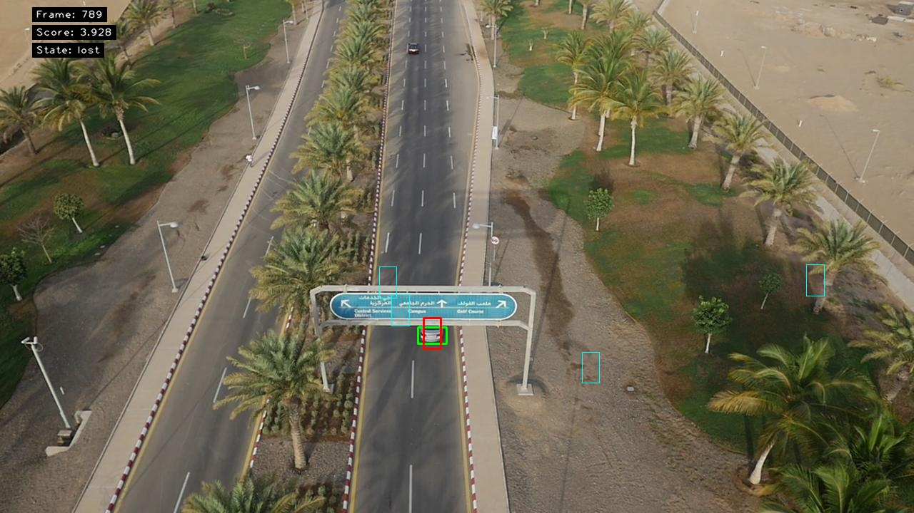
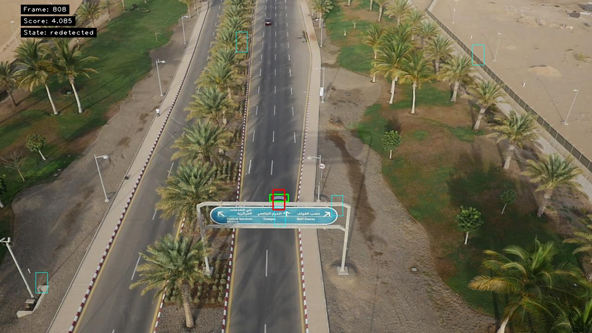

# Long-Term Tracking with SiamFC

This assignment is about long-term tracking. I used SiamFC as the short-term tracker and added a lost/re-detection mode so the tracker can recover when the target disappears or the local search drifts.

## What I did

- Used SiamFC as the base tracker.
- Added a confidence score based on the maximum raw correlation response.
- Marked the target as lost when the confidence score fell below a threshold.
- Added full-image re-detection by sampling candidate regions.
- Compared uniform and Gaussian sampling during re-detection.
- Tested threshold and sample-count settings on the `car9` sequence.

## Results

Main result on `car9`:

| Tracker | Precision | Recall | F-score |
| --- | ---: | ---: | ---: |
| SiamFC | 0.639 | 0.271 | 0.381 |
| SiamFC-LT | 0.602 | 0.596 | 0.599 |

The long-term version improves recall a lot because it stops trusting the local search when the target is lost and tries to re-detect the target elsewhere in the image.

Other observations:

- Threshold `3.5` was too low and allowed drift to continue for too long.
- Thresholds `4.0` and `4.5` worked better.
- Using 4 samples was already enough for the tested recovery events on `car9`.
- Gaussian sampling gave a small improvement over uniform sampling in one experiment.
- One clear re-detection happened after 19 lost frames, from frame 789 to frame 808.

## Example figures

Example frames exported for the lost/re-detection part:





## Files

```text
assignment5-material/
  run_tracker.py                 # Tracker runner
  run_optional_experiments.py    # Threshold/sampling experiments
  performance_evaluation.py      # Precision/recall/F-score evaluation
  export_redetection_examples.py # Figure export for lost/recovered frames
  siamfc/                        # SiamFC implementation
Report-template/
  main.tex                       # Report source
  main.pdf                       # Compiled report
results/
  optional-car9/                 # Experiment outputs
siamfc_net.pth                   # SiamFC model weights (not included in git)
```

## How to run

```bash
cd assignment5-material
python run_tracker.py
python run_optional_experiments.py
```

The long-term tracking dataset and SiamFC weights are excluded from the repository version because they are large.

## Tools

- Python
- PyTorch
- SiamFC
- NumPy
- OpenCV
- Long-term tracking evaluation
